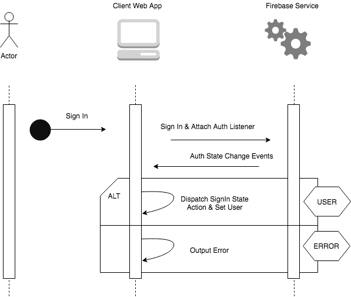

### Build Status

### Description
Vue.JS project, which displays basic employee information. Consists of three main Components, which act as views, and a single one, which is being used to display detailed entity info in the form of an element.

Views:
1. SignIn.vue
1. Dashboard.vue
1. Employee.vue

Elements:
1. EmployeeDetails.vue

#### Store/State Management
The Web App functions with the help of `Vuex` (https://vuex.vuejs.org/), in order to properly manage the App's State. State-changing mutations are dispatched using Store Actions, named as follows:
1. `signIn`
1. `signOut`
1. `setEmployees`
1. `setEmployeeForDetails`

#### Navigation
The Web Client App used `Vue-Router` (https://router.vuejs.org/), in order to properly handle the in-app routing. `History`-mode is being made us of, thus the `hash`-mode does not appear in the URL.

To make sure that the end User does not interfere with non-existing pages, or any page that they do not have access for, the `Auth-State-Changes` mechanism comes into help by Firebase's Web SDK.

#### Basic Flow Representation

